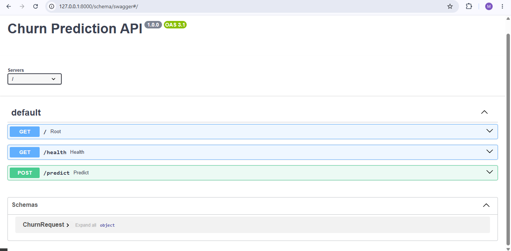
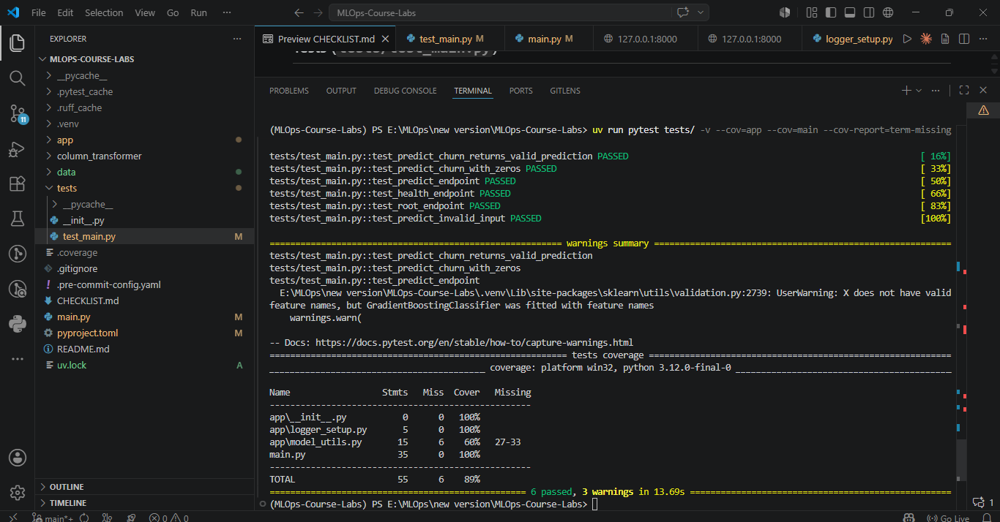
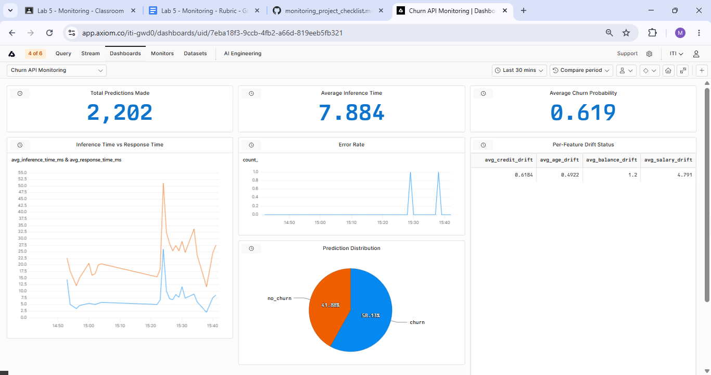

# MLOps Course Labs — Bank Customer Churn Prediction

A complete MLOps project covering model serving, containerization, CI/CD, and monitoring for a bank customer churn prediction API.

---

## Tech Stack

- **Framework:** Litestar
- **Language:** Python 3.12
- **Package Manager:** UV
- **ML:** scikit-learn, joblib
- **Testing:** pytest
- **Containerization:** Docker
- **CI/CD:** GitHub Actions
- **Monitoring:** Axiom

---

## Project Structure
```
MLOps-Course-Labs/
├── .env
├── .dockerignore
├── .gitignore
├── .pre-commit-config.yaml
├── Dockerfile
├── CHECKLIST.md
├── README.md
├── main.py                   # API entrypoint
├── pyproject.toml
├── uv.lock
│
├── app/                      # Application code
│   ├── __init__.py
│   ├── logger_setup.py       # Logging configuration
│   └── model_utils.py        # Model loading and prediction
│
├── column_transformer/       # Saved sklearn column transformer
│   └── column_transformer.joblib
│
├── data/                     # Training data and model artifacts
│   ├── .gitkeep
│   ├── Churn_Modelling.csv
│   └── model.pkl
│
├── tests/                    # Test suite
│   ├── __init__.py
│   └── test_main.py
│
├── assets/                   # Project assets (images, etc.)
│
├── .git/                     # Git repository (hidden)
├── .venv/                    # Virtual environment (hidden)
├── .pytest_cache/            # pytest cache (hidden)
├── .ruff_cache/              # Ruff cache (hidden)
└── __pycache__/              # Python cache (hidden)
```

---

## Setup

```bash
uv sync
uv run pre-commit install
```

Create a `.env` file in the project root:
HYPERDX_API_KEY=your_key
AXIOM_TOKEN=your_token
AXIOM_DATASET=churn-api-logs

---

## API

Start the server:

```bash
uv run litestar --app main:app run --reload
```

| Method | Path | Description |
|--------|------|-------------|
| GET | `/` | Welcome message |
| GET | `/health` | Health check |
| POST | `/predict` | Returns churn prediction and probability |

Swagger UI: `http://localhost:8000/schema/swagger`



---

## Tests

```bash
uv run pytest tests/ -v --cov=app --cov=main --cov-report=term-missing
```

Coverage requirement: above 70%



---

## Docker

Build and run the container:

```bash
docker build -t churn-api .
docker run -p 8000:8000 --env-file .env churn-api
```

---

## CI/CD

GitHub Actions pipeline runs on every push to `main`:

1. **Test** — installs dependencies and runs pytest
2. **Build and Push** — builds Docker image and pushes to Docker Hub
3. **Deploy** — SSHes into EC2 and pulls the latest image

Pipeline configuration: `.github/workflows/ci-cd.yml`

---

## Monitoring

The API sends structured events to Axiom on every request, covering:

- **Server metrics** — response time, request volume, error rate
- **Model metrics** — predicted class distribution, churn probability, inference time
- **Data drift** — Z-score per feature vs training distribution baseline



### Load Testing

```bash
uv run locust --host http://127.0.0.1:8000
```

Open `http://localhost:8089` to run the load test UI.